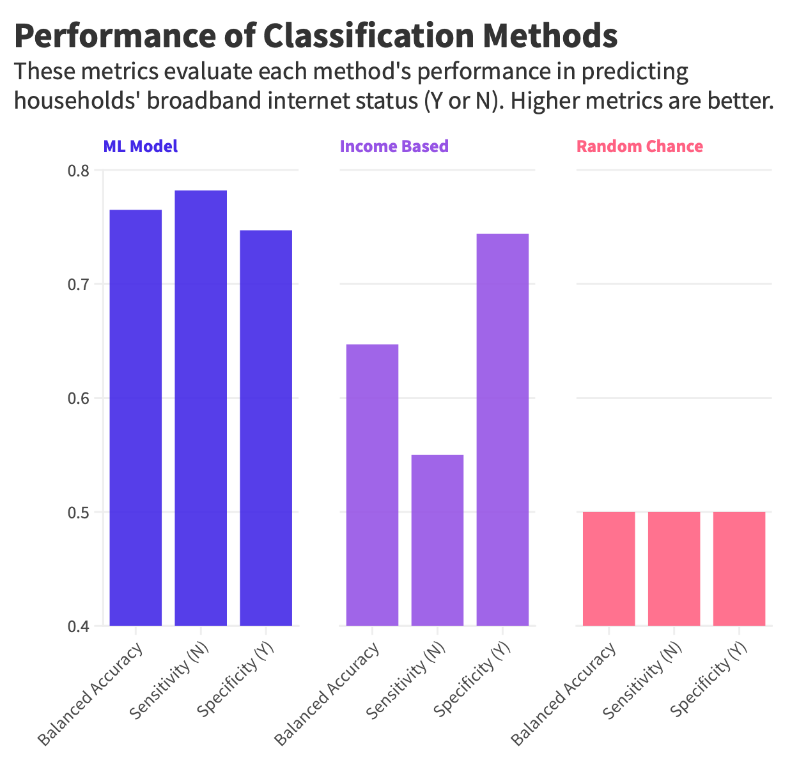
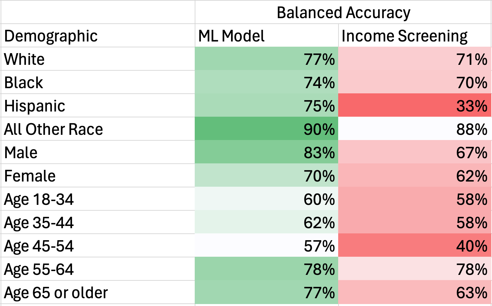

# Philly_Broadband_Internet
## FAQs

**Q: How is eligibility determined for reduced-price broadband internet?**

A: The machine learning model uses applicant answers to predict their probability of lacking broadband internet in their household. Applicants are approved if this probability exceeds a set cutoff. Developed from survey data of 2,500 Philadelphia adults, the model identified trends in the data associated with broadband access. These trends are represented in the mathematical calculation built by the model which is applied to applicant answers, allowing for accurate application screening.

**Q: Why is machine learning used for applicant screening?**

A: In testing, the machine learning model used for applicant screening has been shown to expand eligibility by 42% for households in need over traditional screening methods. This means the model is 42% more accurate than traditional methods at identifying applicants who truly lack broadband internet. Without the machine learning model, applicants would be screened solely based on their household income, limiting households above a predetermined income threshold from receiving benefits even when needed.

**Q: How were sources of bias addressed in model development?**

A: Addressing and testing for bias in model development was paramount to producing equitable outcomes for applicants. The model was not trained on protected identifiers such as age, race, gender, zip code, and language. Additionally, training used a diverse dataset representative of the Philadelphia population. The model's performance in identifying both households with and without broadband internet was optimized through balanced accuracy metrics and weighted evaluation across groups.

**Q: How consistent is the machine learning model performance across demographics?**

A: Below is a summary comparison of machine learning model performance and income-based screening performance across age, race, and gender. Performance metrics at the intersection of these demographics were not sufficiently available for measurement.

**Q: What happens if users opt out of having their application reviewed by AI/ML?**

A: Users may opt out of having their application reviewed by AI/ML and will be screened based on their household income in comparison to a predetermined threshold.

---

## About The Project

- By: Gibson Hurst
- [Github Repo](https://github.com/GibsonHurst/Philly_Broadband_Internet/tree/main)
- [Experiment Tracking and Versioning](https://docs.google.com/spreadsheets/d/1VVerLDv5Q7fAYc8_tDpXzQeFb2LhYZCqbMPIuupxv28/edit?usp=sharing)
- [Data Source](https://opendataphilly.org/datasets/philadelphia-household-internet-assessment-survey/)
- [LinkedIn](https://www.linkedin.com/in/gibson-hurst/)

### Highlights

- Fine-tuned a logistic regression model to accurately identify households in need of reduced-price broadband internet.
- Achieved greater performance than traditional income-based screening methods for assistance programs, including a 42% increase in sensitivity, an 18% increase in balanced accuracy, and no decrease in specificity.
- Logged over 20 experiments with a variety of models and hyperparameters while optimizing for balanced accuracy.
- Addressed model bias through feature selection, choice of evaluation metric, balanced class weights, and evaluation across demographics.
- Built a web application to demonstrate model implementation for programs such as Xfinity Internet Essentials.

### Summary

Following the end of the Affordable Connectivity Program, roughly 177,000 low-income households in Philadelphia faced a $40 increase in their internet bills due to the program's federal funding expiration during the pandemic. Efforts to extend the program in Congress were unsuccessful. Current public and private internet assistance programs rely on weak income-based heuristics or proxies for low-income, such as participation in other assistance programs. In this project, data from the Philadelphia 2021 Household Internet Assessment Survey was used with advanced predictive models to accurately determine households lacking broadband internet, while protecting sensitive information such as race, gender, age, language, and zip code. This solution can be implemented to screen applicants for internet assistance programs by approving those predicted to lack broadband internet access in their households.

### Methodology

**Task**
- Current internet assistance programs evaluate applicants based on income or a proxy for low-income.
- Hypothesized that factors beyond income, captured in survey data, relate to the need for reduced-price internet.
- Simplified the task into a binary classification problem using various factors, including income, to predict household broadband internet status.
- Objective: Improve sensitivity in identifying households without internet without compromising specificity.

**Data**
- Utilized data from the 2021 Philadelphia Household Internet Assessment Survey.
- Included responses from 2,500 households.

**Exploratory Data Analysis**
- Conducted training and testing data splits before EDA and transformations to prevent data leakage.
- Found 14% of income reports were unknown or refused, suggesting potential predictive power.
- Identified a strong class imbalance with 6 times more households having than lacking broadband internet.
- Added calculated features and transformations (e.g., log, sqrt, x^2).
- Analyzed correlations between broadband internet status and original, calculated, and transformed features.

**Data Transformations**
- Selected features and dropped unnecessary ones for the task.
- Constructed a pipeline for transformations to simplify training and inference on new data.
- Created duplicates of promising calculated features from EDA.
- Categorized unknown or refused income reports as binary features.
- Imputed missing values using training feature median values.
- Converted categorical features via one-hot encoding.
- Standardized continuous features to mean 0 and unit standard deviation.

**Modeling**
- Logged over 20 potential models and numerous hyperparameter combinations.
- Experimented with logistic regression and various regularization methods.
- Tested support vector machines and kernel techniques.
- Tried stochastic gradient descent classifier with different loss functions.
- Explored tree-based classifiers like random forest.

**Model Improvements and Evaluation**
- Developed a Google Sheet for storing model metrics and hyperparameters to facilitate reproducibility and comparison.
- Tracked training and cross-validation metrics across all model experiments.
- Tuned hyperparameters via grid search and random search for all model types.
- Selected logistic regression as the final model with C=0.1, balanced class weights, LASSO (l1) regularization to reduce dimensionality, and Saga solver for regularization support.
- Applied the final model to test data and calculated performance metrics.
- Assessed baseline performance metrics of heuristics such as random chance and household income < $30,000.
- Visualized performance comparisons among the final model, income < $30K heuristic, and random chance predictions.

**Addressing Bias**
- Avoided training the model on protected information such as race, age, gender, zip code, and language.
- Selected the balanced accuracy metric to align with sensitivity and specificity goals.
- Applied class weights to logistic regression to resolve class imbalance and prioritize households with and without broadband internet.
- Evaluated model performance across demographics, including race, gender, and age, comparing to the income < $30k heuristic.

**Final Product**
- Constructed a web application simulating an internet assistance program application.
- Integrated the final model into the web app to predict broadband internet status for applicants.
- Incorporated logic to approve applications predicted not to have broadband internet.
- Provided an opt-out for AI/ML evaluation, reverting to income-based evaluation.
- Added logic to approve households opting out of ML evaluation with household income < $30,000.
